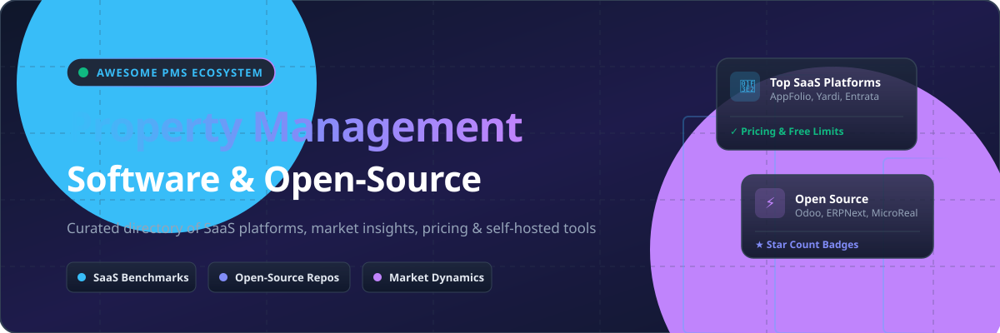

  

# 🏢 Awesome Property Management Software & Open-Source Ecosystem 🚀

  
  
  
  
  
  

> **Curated Directory of Top SaaS Property Management Platforms, Real Estate Tech, Landlord Tools & Self-Hosted Open-Source Software**

*Focused on Residential & Multifamily Property Management, Tenant Portals, Leasing Automation, Rent Collection, Maintenance Work Orders, Accounting & Owner Reporting.*

---

## 📌 Table of Contents

- [📊 Sector Overview & Market Dynamics](#-sector-overview--market-dynamics)
- [💼 SaaS / Hosted Property Management Platforms](#-saas--hosted-property-management-platforms)
- [🔓 Open-Source GitHub Projects](#-open-source-github-projects)
- [💡 Additional Open-Source Options & DIY Frameworks](#-additional-open-source-options--diy-frameworks)
- [🤝 How to Contribute](#-how-to-contribute)
- [📈 Star History](#-star-history)
- [⚠️ Disclaimer](#%EF%B8%8F-disclaimer)

---

## 📊 Sector Overview & Market Dynamics

The global **Property Management Software (PMS)** market is estimated at **$2.8 Billion to $5.5 Billion+** (with broader real estate tech projections exceeding **$20 Billion** by 2030), growing at an estimated CAGR of **6% – 9%**.

### 🧩 Sector Fragmentation & Competition Structure
The market is **moderately to highly fragmented**:
- **Enterprise & Enterprise-Mid Segment (Concentrated)**: Dominated by institutional behemoths like **Yardi** and **AppFolio**, alongside private-equity-backed powerhouses (**Entrata**, **Buildium/RealPage**). These platforms feature deep compliance, complex ledger accounting, and AI-driven workflow engines.
- **SMB Landlord & Mid-Market Segment (Highly Fragmented)**: Characterized by fast-growing SaaS startups (**DoorLoop**, **Hemlane**) and freemium landlord platforms (**TurboTenant**). This segment serves self-managing landlords, single-family portfolios, and growing property managers who value transparent per-unit pricing, modern UX, and quick onboarding over complex enterprise ERP setups.

---

## 💼 SaaS / Hosted Property Management Platforms

> Below is a benchmark breakdown of leading commercial SaaS property management platforms, sorted descending by **Company Size (Revenue / Valuation / Market Cap)**.

| Platform | Description | Starting Pricing | Free Tier / Trial Limits | Company Size (Valuation / Revenue) 📈 |
| :--- | :--- | :--- | :--- | :--- |
| **[AppFolio](https://www.appfolio.com/)** 🏢 | Feature-rich, AI-enhanced property management platform popular with professional managers for automation, leasing, accounting, and operations. | $1.49/unit/month ($280/mo min spend, 50 units minimum) | No free trial (Free live demo available) | **~$7.5B Market Cap** ($1.1B+ Annual Revenue; Public: APPF) |
| **[Entrata](https://www.entrata.com/)** 🏙️ | Multifamily property management and resident experience platform used by larger apartment operators. | ~$4.00–$8.00/unit/month (Custom quote based on portfolio size) | No free trial (Free live demo available) | **$4.3B Valuation** ($574M Run-Rate Revenue; Private / IPO-filed) |
| **[Yardi Systems](https://www.yardi.com/)** 🌐 | Enterprise-grade property management suite widely used for large multifamily, commercial, and complex real-estate portfolios. | $1.00/unit/month ($100/mo min for Yardi Breeze) | No free trial (Free live demo available; 30-day cancellation window) | **~$1.6B - $1.8B Est. Revenue** (Private, Bootstrapped leader) |
| **[Buildium](https://www.buildium.com/)** 🏘️ | Comprehensive property management platform with strong accounting, leasing, tenant portals, and scalability for growing portfolios. | $62/month (Essential plan) | 14-day free trial | **$580M Acquisition / Valuation** ($60M+ Annual Revenue; Acquired by RealPage) |
| **[DoorLoop](https://www.doorloop.com/)** ⚡ | Modern all-in-one property management platform known for ease of use, transparent pricing, and solid mid-market capabilities. | $59/month (billed annually, covers up to 20 units) | No free trial (Free live demo available) | **~$500M Est. Valuation** ($130M+ Total VC Funding raised) |
| **[Propertyware](https://www.propertyware.com/)** 🏠 | Property management platform especially strong for single-family and scattered-site residential portfolios. | $1.00/unit/month ($250/mo minimum spend) | Free trial available upon request / live demo | **~$100M+ Est. Revenue** (Part of RealPage / Thoma Bravo portfolio) |
| **[Rent Manager](https://www.rentmanager.com/)** 📋 | Flexible property management software supporting residential and commercial portfolios with strong accounting and customization options. | $1.00/unit/month ($200/mo minimum spend) | No free trial (Free live demo available) | **~$50M - $100M Est. Revenue** (Private / LCS) |
| **[TurboTenant](https://www.turbotenant.com/)** 🎯 | Landlord-focused platform offering free and paid tools for listings, screening, rent collection, and basic management. | Free plan ($149/year for Premium plan) | **Free Forever Plan** (unlimited property marketing, screening, & rent collection) | **~$67M Total Funding** (~$10M Est. Annual Revenue) |
| **[Hemlane](https://www.hemlane.com/)** 🔑 | Property management platform that combines software with optional full-service management support for residential landlords. | $30/month base ($28 base + $2/unit/month for Basic) | 14-day free trial | **~$12M Total VC Funding** (~$9.1M Est. ARR) |
| **[Folio](https://www.folio.co/)** 📧 | Cloud property management & transaction organization solution focused on streamlined operations and owner/tenant experiences. | $29/month (Pro plan billed annually) | **Free Forever Plan** (up to 2 active Smart Folders) / 14-day Pro trial | **Bootstrapped / Early Stage** (~$2M - $5M Est. Revenue) |

---

## 🔓 Open-Source GitHub Projects

> Community-built, self-hosted, and customizable property management tools, sorted descending by **GitHub Star Count**.

| Project & Repo Link | Star Count ⭐️ | Description 📝 | Primary Stack 🛠️ |
| :--- | :--- | :--- | :--- |
| **[Odoo Real Estate / Property](https://github.com/odoo/odoo)** 🏢 |  | Modular ERP platform with rich community modules for real estate leasing, property tracking, and multi-entity accounting. | Python / JS |
| **[ERPNext Property Management](https://github.com/frappe/erpnext)** 💼 |  | Open-source enterprise resource planner featuring tenant tracking, lease billing, and maintenance ticketing extensions. | Python / Frappe |
| **[QloApps](https://github.com/Qloapps/QloApps)** 🏨 |  | Popular open-source booking, property management system (PMS), and reservation engine for boutique stay & rental operators. | PHP / PrestaShop |
| **[MicroRealEstate](https://github.com/microrealestate/microrealestate)** 🏡 |  | Full-stack self-hosted Web app designed for independent landlords to manage properties, leases, tenants, rent receipts, & payments. | Node.js / React / Docker |
| **[MicroCommunity (HC)](https://github.com/java110/MicroCommunity)** 🌆 |  | Enterprise microservice-based community and residential property management platform covering fee collections & maintenance orders. | Java / Spring Boot |
| **[PropertyWebBuilder](https://github.com/etewiah/property_web_builder)** 🌐 |  | Open-source CMS engine for building real estate listing websites, tenant lead capture, and property displays. | Ruby on Rails |
| **[Condo Software](https://github.com/open-condo-software/condo)** 🏢 |  | Open-source residential management SaaS built for tracking resident tickets, payments, metering, and property communications. | TypeScript / Node / GraphQL |
| **[HotelDruid](https://github.com/digital-druid/hoteldruid)** 🔑 |  | Lightweight property reservation manager for apartments, vacation rentals, and small residential property groups. | PHP |

---

## 💡 Additional Open-Source Options & DIY Frameworks

- 🛠️ **Custom Self-Hosting Strategy**: Self-host an open property manager (e.g., MicroRealEstate) → track units, leases, and tenant ledgers → process rent via Stripe/Plaid APIs → generate owner financial reports.
- ⚙️ **ERP Adaptations**: Utilize **Odoo** or **ERPNext** when complex multi-company accounting, payroll, or procurement workflows are required alongside unit lease management.
- ⚖️ **Commercial vs. Open Source Tradeoffs**: Open-source solutions offer full data sovereignty and zero per-unit fees. However, mature tenant screening integrations, automated ACH rent collection, native mobile apps, and legal compliance features usually favor commercial SaaS platforms (**AppFolio**, **Buildium**, **TurboTenant**).

---

## 🤝 How to Contribute

1. 🍴 **Fork** this repository.
2. 📝 **Add or update** entries in `README.md` following the table formatting.
3. 🔗 **Include**: Software Name, Official Link, Pricing, Free Tier / Trial limits, and Factual Descriptions.
4. 🚀 **Submit a Pull Request (PR)** with a summary of changes.

---

## 📈 Star History

---

## ⚠️ Disclaimer

- This repository is a **community-curated list** provided for educational and informational purposes only.
- Property management involves legal lease agreements, financial transactions, security deposits, and regulated housing laws (Fair Housing Act, local landlord-tenant laws). Always perform independent due diligence and seek legal/financial advice before deploying software for operational property portfolios.

---

  <b>⭐ Star this repository if you find it useful for your property management technology research! ⭐</b>

